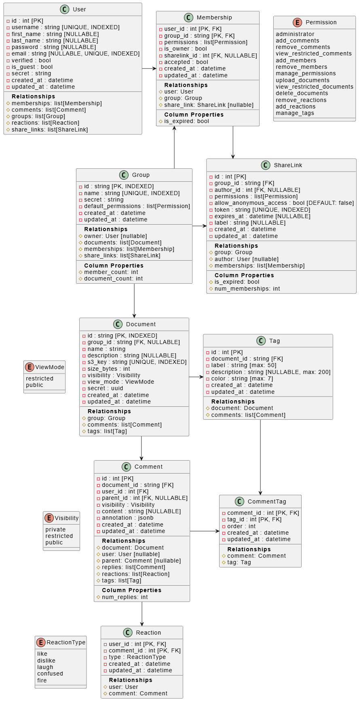

# 🗄️ Database

> [Back to main README](../../README.md)

## 📊 Schema

<div align="center">
  
</div>

> The source diagram is at [`docs/schema.puml`](../../docs/schema.puml). To regenerate the image, render the PlantUML file to `docs/schema.png`.

---

## 🔄 Migrations

Migrations are managed by [Alembic](https://alembic.sqlalchemy.org/) and stored in `versions/`.

### Common Commands

```bash
# Activate the backend virtualenv first
cd backend
source .venv/bin/activate
cd database

# Apply all pending migrations
alembic upgrade head

# Create a new migration from model changes
alembic revision --autogenerate -m "description of change"

# Roll back the last migration
alembic downgrade -1

# Show current revision
alembic current

# Show migration history
alembic history
```

### Automatic Migrations in Production

When the backend Docker container starts, `docker-entrypoint.sh` automatically applies pending migrations using a PostgreSQL advisory lock to prevent concurrent execution across multiple container replicas. See [Deployment: Automatic Migrations](../../docs/deployment.md#-automatic-migrations).

---

## 🌱 Database Initialization

For a fresh database, Alembic alone is sufficient:

```bash
cd backend/database
alembic stamp base
alembic upgrade head
```

### Seeding with existing data

[`init.py`](init.py) is a utility script that wraps the above and additionally seeds the database from a SQL dump file and uploads files to S3. This is useful for restoring a backup or setting up a demo environment.

First follow the [development setup instructions](../../docs/deployment.md#-development-setup) to create a virtual environment and activate it, then navigate to this directory and run:

```bash
python init.py --sql-dump dumps/dump.sql --s3-upload-dir dumps/s3
```

By default this backs up the database content before applying any changes. If the backup fails the script does not start touching the database.

The backup can be skipped using the `--no-backup` flag:

```bash
python init.py --sql-dump dumps/dump.sql --no-backup
```
